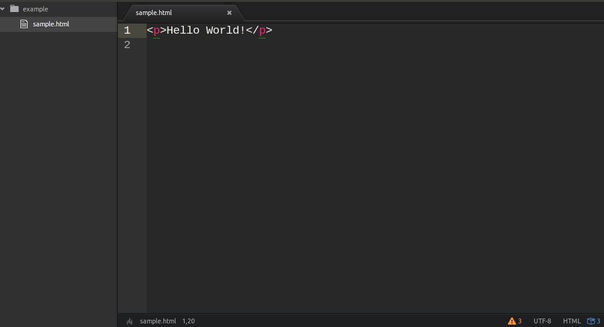
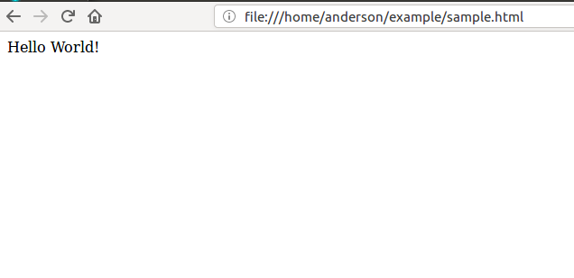

# HOMEWORK ASSIGNMENT ONE

### DEVELOPMENT ENVIRONMENT

Take 5 screenshots.

Four screenshots should be of your **Text Editor**, preferably **Atom**.  These screenshots should
include a **jquery** file, a **bootstrap javascript** file, a **bootstrap CSS** file, and an **HTML**
file.

Below is an image for reference.  Your **HTML** file should be more filled out than this.  In your **HTML** file include at least one `h1` tag and make a call to the **bootstrap CSS** file, the **jquery** file, and the **bootstrap javascript** file between the opening and closing `head` tags.

One screenshot should be of your web browser with the HTML file loaded and on display.  You'll know the **bootstrap CSS** is working if your text goes from being a **Serif** font to a **Sans-Serif** font.

*NOTE: If you are having a hard time, please watch/follow along with the screencast found [here](https://www.youtube.com/watch?v=S5n6VUvL_MM&feature=youtu.be).*
